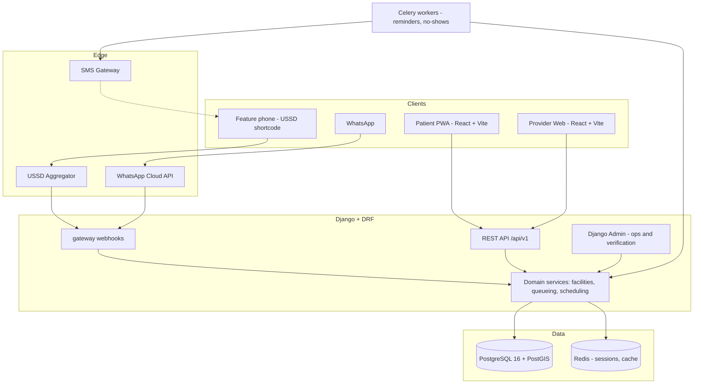

# 01 - System Architecture

## 1. Actors

| Actor | Primary need | Device reality |
|---|---|---|
| Patient (urban) | Find, verify insurance, book, track queue | Android smartphone, intermittent data |
| Patient (rural / elderly) | The same, without a smartphone | Feature phone -> USSD and SMS only |
| Receptionist | Check patients in fast, call the next one | Shared PC or tablet, unreliable power and network |
| Clinician | Today's patient list | May remain on paper - do not force adoption |
| Facility admin | Hours, services, insurers, slot templates | Web browser |
| MediLink ops | Verify facilities, monitor, support | Django admin |

The **MediLink ops** row is real recurring work, not a formality. "Verified
providers" means a human on our team confirmed the facility exists, is licensed,
and that its insurance list is accurate. Budget staff time for it.

## 2. Subsystems

Build these as Django apps inside one project - a **modular monolith**. Do not
start with microservices; the team is small and the boundaries are still moving.

| App | Responsibility | Depends on |
|---|---|---|
| `facilities` | Directory, geo search, verification workflow | - |
| `insurance` | Insurer registry, facility acceptance mapping | `facilities` |
| `scheduling` | Slot templates, appointments, cancellation, no-shows | `facilities`, `patients` |
| `queueing` | Check-in, live position, ETA calculation | `facilities`, `patients` |
| `patients` | Phone-based identity, preferences, language | - |
| `gateway` | USSD + WhatsApp webhooks, session state | all of the above |
| `notifications` | SMS and web push dispatch, Celery tasks | `queueing`, `scheduling` |
| `triage` | Rule-based symptom router (Phase 4) | `facilities` |

**Rule:** apps communicate through service functions in `apps/<app>/services.py`,
never by importing another app's views or serializers. When a boundary later needs
to become a network call, only `services.py` changes.

## 3. Component diagram



## 4. The two critical request flows

### 4.1 Nearby facilities (patient opens the app)

Full detail in [04-nearby-facilities.md](04-nearby-facilities.md).

```
Browser geolocation
  -> GET /api/v1/facilities/nearby?lat=&lng=&insurer=&service=
  -> facilities.services.find_nearby()
       PostGIS ST_DWithin on a GIST index
       + insurance filter
       + opening-hours filter
       + queueing.services.wait_snapshot() per facility
  -> ranked list with distance, open state, wait or "unavailable"
```

Target: **p95 under 400 ms** for a 5 km radius in Kigali.

### 4.2 Live queue position (the product)

```
Receptionist taps "Check in"  ->  POST /api/v1/queue/entries
                                    creates QueueEntry(status=WAITING)

Patient PWA polls every 20 s  ->  GET /api/v1/queue/entries/{id}
                                    position = COUNT(waiting ahead) + 1
                                    eta      = position x rolling_service_time
                                    leave_by = now + eta - travel - buffer

Celery beat every minute      ->  if leave_by is within 5 minutes and no
                                  notification sent yet: SMS "Leave home now"
```

## 5. Real-time strategy: poll, do not use WebSockets

A hospital queue advances roughly **8-15 times per hour**. Django Channels would
add ASGI, a channel layer, and a class of connection-lifecycle bugs in order to
serve data that changes every four minutes.

**Decision: HTTP polling at 20-second intervals.**

- Survives the network dropping and returning, which WebSockets handle badly on
  mobile networks.
- Requires no additional infrastructure.
- Three lines with TanStack Query.
- Costs roughly 180 requests per patient per hour of waiting - trivial.

Revisit only if a facility asks for a wall-mounted "now serving" display, which
genuinely benefits from push.

## 6. Offline and degraded operation

| Component | Requirement |
|---|---|
| Reception check-in | **Must work offline.** Queue writes into IndexedDB, sync on reconnect. This is the one operation that may never fail. |
| Patient nearby search | Serve last cached result with a visible "offline - showing saved list" banner. |
| Patient queue view | Show last known position with its timestamp. Never extrapolate a stale position forward. |
| USSD | Inherently online. If the backend is down, reply `END Serivisi ntibonetse. Ongera ugerageze.` - never a blank response. |

Conflict rule for offline check-in sync: the server takes `joined_at` from the
**client-recorded timestamp**, not from arrival time at the server, so a
receptionist who was offline for ten minutes does not push their patients to the
back of the queue.

## 7. Deployment topology

```
                      +--------------------------+
   Internet  ------->  |  Nginx / Caddy (TLS)     |
                      +------------+-------------+
                                   |
              +--------------------+--------------------+
              |                    |                    |
              v                    v                    v
       Gunicorn (Django)     Static: PWA         Static: Provider
              |
      +-------+--------+
      |       |        |
      v       v        v
  Postgres  Redis   Celery worker + beat
  + PostGIS
```

Start on a **single VM in a Rwandan or regional data centre** - see
[08-security-and-compliance.md](08-security-and-compliance.md) for why hosting
location is a legal question and not only a latency one. Decide it before writing
deployment code.

## 8. API conventions

- Base path `/api/v1/`. Version in the URL; never break v1 silently.
- JSON only. `snake_case` keys.
- Auth: JWT access + refresh (`djangorestframework-simplejwt`) for patients and
  provider staff. USSD/WhatsApp webhooks authenticate by shared secret plus
  source-IP allowlist, not JWT.
- Pagination: cursor-based for lists that grow (queue history), page-number for
  bounded lists (nearby facilities, capped at 50).
- Errors use an RFC-7807-style body:

```json
{
  "type": "validation_error",
  "detail": "lat must be between -2.9 and -1.0",
  "field": "lat"
}
```

- Every response carrying derived live data includes `as_of`, so clients can
  display staleness honestly.

## 9. Type safety across the boundary

Do **not** hand-write TypeScript API types.

```
Django models
  -> drf-spectacular      -> schema.yaml (OpenAPI 3)
  -> openapi-typescript   -> web-*/src/api/types.ts
```

Wire this into CI so that a backend change which breaks a frontend fails the
build, rather than failing at a reception desk.

## 10. Architecture decision record

| # | Decision | Rejected alternative | Reason |
|---|---|---|---|
| 1 | Django + DRF | FastAPI | GeoDjango, plus the free admin panel - ops verification UI costs zero lines |
| 2 | Modular monolith | Microservices | Small team; boundaries still moving |
| 3 | PostGIS | Haversine in Python | Correct distance maths, GIST index, `ST_DWithin` |
| 4 | React PWA | React Native | No store friction, instant updates, small download, one React codebase |
| 5 | SMS primary notification | Push only | Reaches feature phones and patients who are out of data |
| 6 | Polling | WebSockets | Queue changes ~8x/hour; polling is robust on mobile networks |
| 7 | Computed queue position | Stored `position` column | Stored positions go stale and force mass row rewrites |
