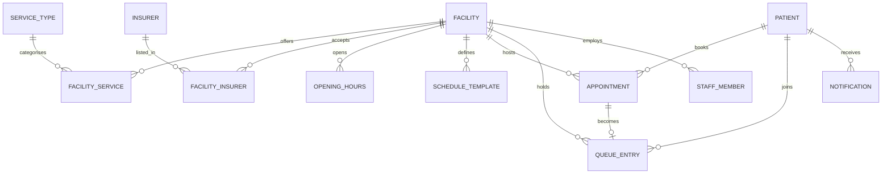

# 02 - Data Model

## 1. Entity relationship overview



## 2. Design decisions that shape the schema

**Phone number is identity.** A patient may arrive from the PWA, USSD, or
WhatsApp. All three must resolve to one `Patient` row. Store phone in E.164
(`+2507XXXXXXXX`) and normalise on write - never trust client formatting.

**Queue position is computed, never stored.** A stored `position` column goes
stale the instant anyone is served and forces a rewrite of every row in the
queue. Compute it with a `COUNT` of the waiting entries ahead.

**National ID is hashed, or absent.** We do not need to know a patient's ID
number; we need to know whether two records are the same person. Store
`national_id_hash` (SHA-256 with a server-side pepper) or nothing at all. See
[08-security-and-compliance.md](08-security-and-compliance.md).

**Soft-delete nothing clinical.** Appointments and queue entries transition
through statuses; they are never deleted. The audit trail is a compliance
requirement.

## 3. `facilities`

```python
# backend/apps/facilities/models.py
from django.contrib.gis.db import models
from django.utils import timezone


class Facility(models.Model):
    class Ownership(models.TextChoices):
        PUBLIC      = "public",      "Public"
        PRIVATE     = "private",     "Private"
        FAITH_BASED = "faith_based", "Faith-based"

    class Level(models.TextChoices):
        HEALTH_POST      = "health_post",      "Health post"
        HEALTH_CENTRE    = "health_centre",    "Health centre"
        DISTRICT_HOSPITAL = "district_hospital", "District hospital"
        REFERRAL_HOSPITAL = "referral_hospital", "Referral hospital"
        CLINIC           = "clinic",           "Clinic / polyclinic"
        PHARMACY         = "pharmacy",         "Pharmacy"

    name        = models.CharField(max_length=200)
    slug        = models.SlugField(max_length=220, unique=True)
    ownership   = models.CharField(max_length=20, choices=Ownership.choices)
    level       = models.CharField(max_length=24, choices=Level.choices)

    province    = models.CharField(max_length=50)
    district    = models.CharField(max_length=50)
    sector      = models.CharField(max_length=50)
    address     = models.CharField(max_length=255, blank=True)
    location    = models.PointField(geography=True, srid=4326)

    phone       = models.CharField(max_length=20, blank=True)
    email       = models.EmailField(blank=True)

    # Verification workflow - only verified facilities appear in search
    verified_at = models.DateTimeField(null=True, blank=True)
    verified_by = models.ForeignKey("auth.User", null=True, blank=True,
                                    on_delete=models.SET_NULL,
                                    related_name="verified_facilities")
    verification_note = models.TextField(blank=True)

    # True once the facility runs our reception tool, i.e. live queue data exists
    reports_queue = models.BooleanField(default=False)

    created_at  = models.DateTimeField(auto_now_add=True)
    updated_at  = models.DateTimeField(auto_now=True)

    class Meta:
        verbose_name_plural = "facilities"
        indexes = [
            models.Index(fields=["district"]),
            models.Index(fields=["verified_at"]),
            # GIST index on location is created by the migration - see 3.1
        ]

    @property
    def is_verified(self) -> bool:
        return self.verified_at is not None

    def __str__(self) -> str:
        return f"{self.name} ({self.district})"
```

### 3.1 The spatial index (do not skip this)

`PointField` alone does not create the index that makes `ST_DWithin` fast. Add it
explicitly in a migration:

```python
# backend/apps/facilities/migrations/0002_location_gist_index.py
from django.db import migrations
from django.contrib.postgres.operations import CreateExtension


class Migration(migrations.Migration):
    dependencies = [("facilities", "0001_initial")]

    operations = [
        CreateExtension("postgis"),
        migrations.RunSQL(
            sql="CREATE INDEX facility_location_gist "
                "ON facilities_facility USING GIST (location);",
            reverse_sql="DROP INDEX facility_location_gist;",
        ),
    ]
```

Without it, every nearby search is a sequential scan over the whole table.

### 3.2 Services and opening hours

```python
class ServiceType(models.Model):
    """General consultation, maternity, dental, laboratory, pharmacy, ..."""
    code      = models.SlugField(max_length=40, unique=True)
    name_en   = models.CharField(max_length=100)
    name_rw   = models.CharField(max_length=100)
    name_fr   = models.CharField(max_length=100)
    is_triage_target = models.BooleanField(default=True)


class FacilityService(models.Model):
    facility     = models.ForeignKey(Facility, related_name="services",
                                     on_delete=models.CASCADE)
    service_type = models.ForeignKey(ServiceType, on_delete=models.PROTECT)
    available    = models.BooleanField(default=True)

    class Meta:
        unique_together = ("facility", "service_type")


class OpeningHours(models.Model):
    facility  = models.ForeignKey(Facility, related_name="opening_hours",
                                  on_delete=models.CASCADE)
    weekday   = models.SmallIntegerField()      # 0 = Monday ... 6 = Sunday
    opens_at  = models.TimeField()
    closes_at = models.TimeField()

    class Meta:
        unique_together = ("facility", "weekday", "opens_at")
        ordering = ["weekday", "opens_at"]
```

Two `OpeningHours` rows per weekday model a lunch break. A facility open 24
hours has one row per day of `00:00`-`23:59`.

## 4. `insurance`

```python
# backend/apps/insurance/models.py
class Insurer(models.Model):
    code      = models.SlugField(max_length=30, unique=True)   # mutuelle, rssb, mmi
    name      = models.CharField(max_length=120)
    is_public = models.BooleanField(default=True)
    sort_order = models.PositiveSmallIntegerField(default=100)


class FacilityInsurer(models.Model):
    """Facility-declared acceptance. This is level-1 eligibility."""
    facility  = models.ForeignKey("facilities.Facility",
                                  related_name="insurers",
                                  on_delete=models.CASCADE)
    insurer   = models.ForeignKey(Insurer, on_delete=models.PROTECT)
    note      = models.CharField(max_length=200, blank=True)
    confirmed_at = models.DateTimeField(null=True, blank=True)

    class Meta:
        unique_together = ("facility", "insurer")
```

**Two levels of eligibility, and we ship only level 1:**

| Level | Question | Source | Phase |
|---|---|---|---|
| 1 | Does this facility accept Mutuelle at all? | Facility-declared, ops-verified | Phase 0 |
| 2 | Is *this patient's* cover currently active? | Requires an RSSB integration | Partnership goal, not scheduled |

Never imply level 2 in the UI. The copy is "Accepts Mutuelle de Sante", never
"You are covered".

## 5. `patients`

```python
# backend/apps/patients/models.py
class Patient(models.Model):
    class Language(models.TextChoices):
        RW = "rw", "Kinyarwanda"
        EN = "en", "English"
        FR = "fr", "Francais"

    phone      = models.CharField(max_length=20, unique=True)   # E.164
    full_name  = models.CharField(max_length=150, blank=True)
    language   = models.CharField(max_length=2, choices=Language.choices,
                                  default=Language.RW)
    insurer    = models.ForeignKey("insurance.Insurer", null=True, blank=True,
                                   on_delete=models.SET_NULL)
    national_id_hash = models.CharField(max_length=64, blank=True)  # SHA-256 + pepper
    home_location    = models.PointField(geography=True, null=True, blank=True)

    created_at = models.DateTimeField(auto_now_add=True)
    last_seen_at = models.DateTimeField(null=True, blank=True)

    class Meta:
        indexes = [models.Index(fields=["phone"])]
```

`home_location` is optional and opt-in. It improves the "leave home by" estimate
when a patient books in advance from somewhere other than home.

## 6. `scheduling`

```python
# backend/apps/scheduling/models.py
class ScheduleTemplate(models.Model):
    """Recurring weekly capacity, from which bookable slots are generated."""
    facility     = models.ForeignKey("facilities.Facility",
                                     related_name="schedule_templates",
                                     on_delete=models.CASCADE)
    service_type = models.ForeignKey("facilities.ServiceType",
                                     on_delete=models.PROTECT)
    weekday      = models.SmallIntegerField()
    start_time   = models.TimeField()
    end_time     = models.TimeField()
    slot_minutes = models.PositiveSmallIntegerField(default=15)
    capacity_per_slot = models.PositiveSmallIntegerField(default=1)
    active       = models.BooleanField(default=True)


class Appointment(models.Model):
    class Status(models.TextChoices):
        BOOKED    = "booked",    "Booked"
        ARRIVED   = "arrived",   "Arrived"
        SERVED    = "served",    "Served"
        NO_SHOW   = "no_show",   "No show"
        CANCELLED = "cancelled", "Cancelled"

    facility     = models.ForeignKey("facilities.Facility",
                                     related_name="appointments",
                                     on_delete=models.PROTECT)
    patient      = models.ForeignKey("patients.Patient",
                                     related_name="appointments",
                                     on_delete=models.PROTECT)
    service_type = models.ForeignKey("facilities.ServiceType",
                                     on_delete=models.PROTECT)

    slot_start   = models.DateTimeField()
    slot_end     = models.DateTimeField()
    status       = models.CharField(max_length=12, choices=Status.choices,
                                    default=Status.BOOKED)
    booked_via   = models.CharField(max_length=12)      # app | ussd | whatsapp | desk
    reference    = models.CharField(max_length=8, unique=True)  # short human code

    created_at   = models.DateTimeField(auto_now_add=True)
    cancelled_at = models.DateTimeField(null=True, blank=True)

    class Meta:
        indexes = [
            models.Index(fields=["facility", "slot_start"]),
            models.Index(fields=["patient", "slot_start"]),
        ]
        constraints = [
            models.UniqueConstraint(
                fields=["patient", "facility", "slot_start"],
                condition=models.Q(status__in=["booked", "arrived"]),
                name="one_active_appointment_per_slot",
            )
        ]
```

`reference` is a short code such as `ML7K2Q`, readable over the phone and short
enough to fit a USSD screen and an SMS.

## 7. `queueing` - the core of the product

```python
# backend/apps/queueing/models.py
from django.db import models
from django.utils import timezone


class QueueEntry(models.Model):
    class Status(models.TextChoices):
        WAITING   = "waiting",   "Waiting"
        CALLED    = "called",    "Called"
        SERVED    = "served",    "Served"
        LEFT      = "left",      "Left without being seen"
        CANCELLED = "cancelled", "Cancelled"

    facility     = models.ForeignKey("facilities.Facility",
                                     related_name="queue_entries",
                                     on_delete=models.PROTECT)
    service_type = models.ForeignKey("facilities.ServiceType",
                                     on_delete=models.PROTECT)
    patient      = models.ForeignKey("patients.Patient", null=True, blank=True,
                                     related_name="queue_entries",
                                     on_delete=models.SET_NULL)
    appointment  = models.OneToOneField("scheduling.Appointment", null=True,
                                        blank=True, on_delete=models.SET_NULL,
                                        related_name="queue_entry")

    # Walk-in patients may have no Patient record at all
    walk_in_name = models.CharField(max_length=150, blank=True)

    joined_at    = models.DateTimeField(default=timezone.now)
    called_at    = models.DateTimeField(null=True, blank=True)
    served_at    = models.DateTimeField(null=True, blank=True)
    closed_at    = models.DateTimeField(null=True, blank=True)

    status       = models.CharField(max_length=12, choices=Status.choices,
                                    default=Status.WAITING)
    checked_in_by = models.ForeignKey("auth.User", null=True, blank=True,
                                      on_delete=models.SET_NULL)
    ticket_code  = models.CharField(max_length=8)   # shown on the paper slip

    class Meta:
        verbose_name_plural = "queue entries"
        indexes = [
            # Drives the position COUNT - the hottest query in the system
            models.Index(fields=["facility", "service_type", "status",
                                 "joined_at"]),
        ]

    def position(self) -> int:
        """Live position. Computed, never stored."""
        return QueueEntry.objects.filter(
            facility_id=self.facility_id,
            service_type_id=self.service_type_id,
            status=self.Status.WAITING,
            joined_at__lt=self.joined_at,
        ).count() + 1
```

### 7.1 Service-time statistics

The ETA needs a rolling average of how long each patient actually takes at this
facility, for this service, at this hour of day. Maintain it as a small
aggregate table, refreshed by a Celery task, rather than computing it per request.

```python
class ServiceTimeStat(models.Model):
    facility     = models.ForeignKey("facilities.Facility",
                                     on_delete=models.CASCADE)
    service_type = models.ForeignKey("facilities.ServiceType",
                                     on_delete=models.CASCADE)
    hour_of_day  = models.SmallIntegerField()            # 0-23
    median_minutes = models.FloatField()
    sample_size    = models.PositiveIntegerField()
    updated_at     = models.DateTimeField(auto_now=True)

    class Meta:
        unique_together = ("facility", "service_type", "hour_of_day")
```

**Use the median, not the mean.** One patient who takes ninety minutes should not
drag the estimate for everyone behind them.

**Do not publish an ETA below `MIN_SAMPLE_SIZE` (suggested: 20).** Below that,
the API returns `wait_status: "insufficient_data"` and the UI says "Wait time not
available". This is the honesty rule from the README, enforced in the data layer.

## 8. `notifications`

```python
class Notification(models.Model):
    class Channel(models.TextChoices):
        SMS  = "sms",  "SMS"
        PUSH = "push", "Web push"

    class Kind(models.TextChoices):
        LEAVE_NOW       = "leave_now",       "Leave now"
        APPOINTMENT_REMINDER = "appt_reminder", "Appointment reminder"
        CALLED          = "called",          "You have been called"
        CANCELLED       = "cancelled",       "Cancelled by facility"

    patient    = models.ForeignKey("patients.Patient", on_delete=models.CASCADE)
    channel    = models.CharField(max_length=6, choices=Channel.choices)
    kind       = models.CharField(max_length=20, choices=Kind.choices)
    body       = models.TextField()
    queue_entry = models.ForeignKey("queueing.QueueEntry", null=True, blank=True,
                                    on_delete=models.SET_NULL)
    sent_at    = models.DateTimeField(null=True, blank=True)
    delivered_at = models.DateTimeField(null=True, blank=True)
    provider_ref = models.CharField(max_length=80, blank=True)

    class Meta:
        constraints = [
            # Never send the same nudge twice for the same queue entry
            models.UniqueConstraint(
                fields=["queue_entry", "kind"],
                name="one_notification_per_kind_per_entry",
            )
        ]
```

That unique constraint is the entire duplicate-SMS defence. A Celery beat task
that runs every minute *will* occasionally overlap itself; the database should be
what stops a patient receiving "Leave now" eleven times.

## 9. Staff and permissions

```python
class StaffMember(models.Model):
    class Role(models.TextChoices):
        RECEPTIONIST = "receptionist", "Receptionist"
        ADMIN        = "admin",        "Facility administrator"
        CLINICIAN    = "clinician",    "Clinician"

    user     = models.OneToOneField("auth.User", on_delete=models.CASCADE)
    facility = models.ForeignKey("facilities.Facility",
                                 related_name="staff",
                                 on_delete=models.CASCADE)
    role     = models.CharField(max_length=14, choices=Role.choices)
    active   = models.BooleanField(default=True)
```

**Every provider-side query is scoped to `request.user.staffmember.facility`.**
Enforce it in a DRF permission class and a queryset mixin, not in each view -
a receptionist at one clinic must never be able to read another clinic's patients.

## 10. Index summary

| Table | Index | Serves |
|---|---|---|
| `facilities_facility` | GIST (`location`) | Nearby search |
| `facilities_facility` | btree (`district`) | Admin filtering, district reports |
| `facilities_facility` | btree (`verified_at`) | Excluding unverified from search |
| `queueing_queueentry` | btree (`facility`, `service_type`, `status`, `joined_at`) | Position COUNT |
| `scheduling_appointment` | btree (`facility`, `slot_start`) | Slot availability |
| `scheduling_appointment` | btree (`patient`, `slot_start`) | "My visits" |
| `patients_patient` | unique btree (`phone`) | Identity lookup on every USSD hit |

## 11. Seed data required before Phase 0 launch

| Dataset | Rows (approx.) | Source |
|---|---|---|
| Insurers | 5-10 | Manual: Mutuelle de Sante, RSSB, MMI, Radiant, Britam, ... |
| Service types | 15-25 | Manual, aligned with facility signage |
| Kigali facilities | 300-500 | Ministry of Health facility list, then field verification |
| Opening hours | ~2000 | Field verification - phone calls and visits |

Facility data collection is the critical path for Phase 0, and it is field work,
not engineering. Start it in parallel with development, not after.

---

## 12. Entities this document does not model

Audited 2026-09-02 against `backend/apps/*/models.py`. Nothing described above
is missing from the code - but nine tables exist that are described nowhere in
this document. Two of them carry a whole feature, and one is a compliance
control, so the gap is worth naming rather than leaving to be discovered.

| Model | App | What it holds |
|---|---|---|
| `Specialty` | `providers` | Clinical specialty, `code` plus `name_rw/en/fr` and descriptions |
| `Provider` | `providers` | A named clinician: `slug`, `title`, languages, verification state |
| `ProviderFacility` | `providers` | Which clinicians practise where - the many-to-many, and the reason a doctor is only reachable through a facility |
| `OTPCode` | `patients` | Phone sign-in codes. Stores `code_hash`, never the code; carries `attempts`, `expires_at`, `consumed_at` |
| `PatientAccessLog` | `patients` | Who read whose record. See doc 08 §6 |
| `NotificationPreference` | `notifications` | Per-patient channel choices |
| `FacilityServiceInsurer` | `insurance` | Insurer acceptance at the service level, not just the facility level |
| `PlatformSettings` | `platform_admin` | Singleton of MediLink-wide settings |
| `TriageOutcome` | `triage` | Recorded result of a triage session. Gated - see doc 09 |

`PatientAccessLog` is worth reading in full before touching anything that
reads patient data. Its `patient` field is deliberately nullable: a queue
board is a *bulk* read, so one row records that a staff member listed N
patients at once. One row per patient would drown the signal this table
exists to surface - a receptionist viewing hundreds of records outside their
shift.
